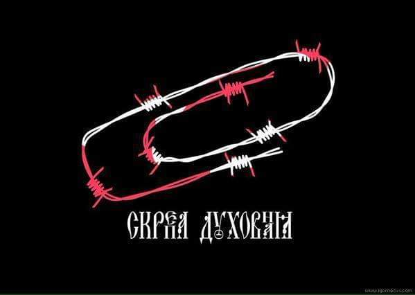
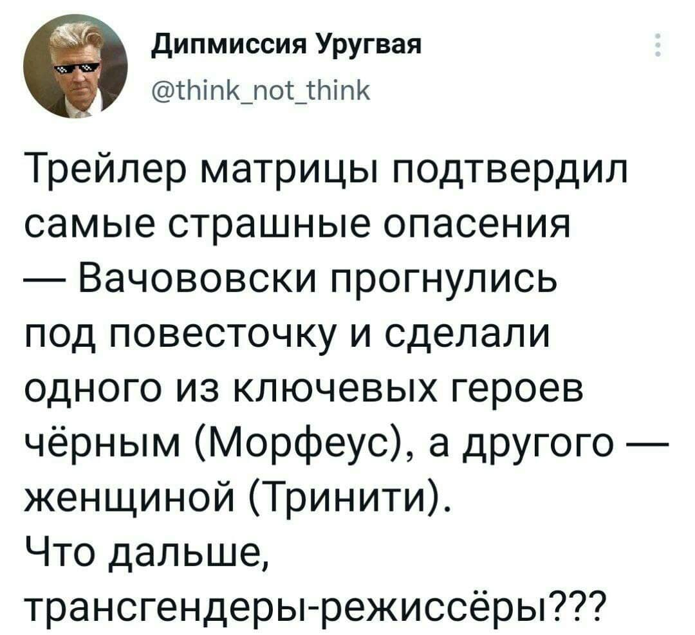
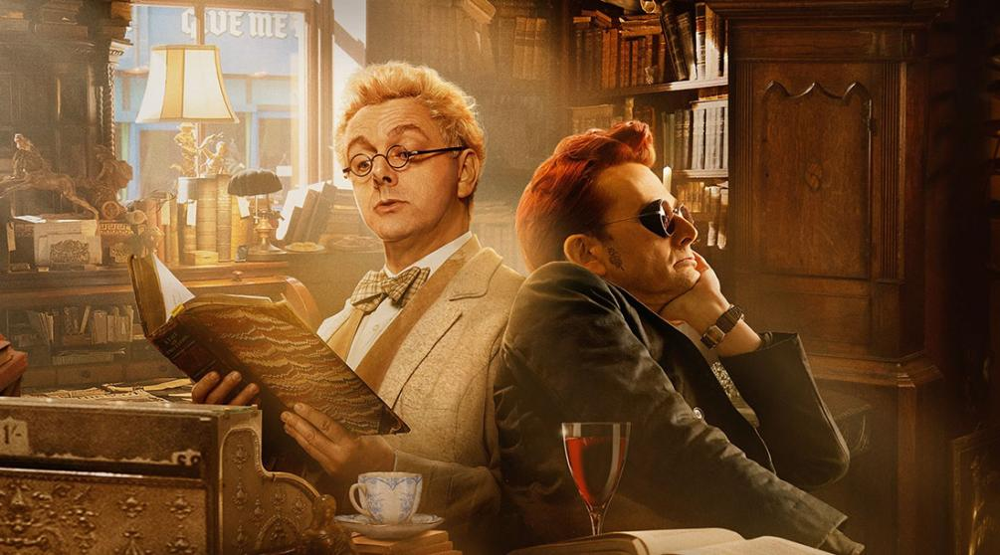
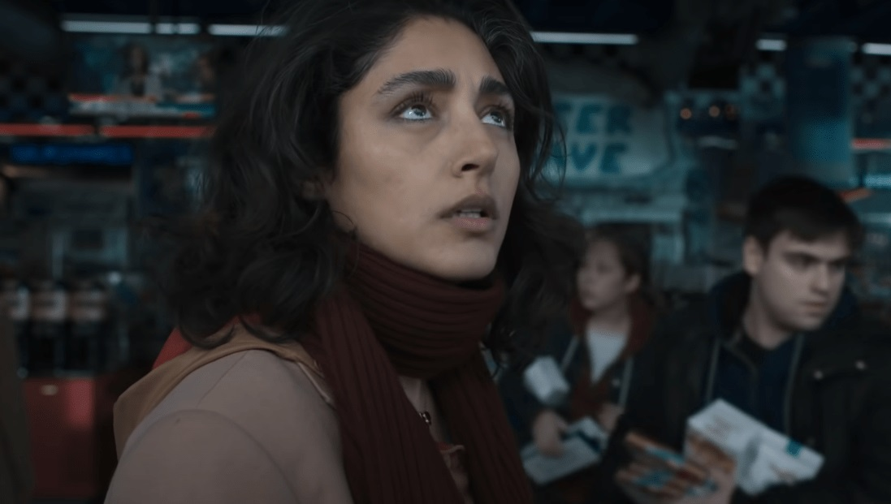

А теперь снова поговорим на всё ещё злобнодневную, но в то же
время потенциально опасную и конфликтогенную тему. На тему ЛГБТ+ и всяких
прочих LiveMatters в массовой
культуре и, в частности, в кино. И для начала с необходимостью уточню, что
никоим образом не возражаю против каких бы то ни было меньшинств – сексуальных,
религиозных или национальных, более того, всячески приветствую вот это всё
разнообразие, соприкасаюсь с ним, взаимодействую и дружу. 
Но всегда начинает раздражать как необоснованное и незаслуженное преследование
чего бы или кого бы то ни было по этим самым признакам, так и неоправданное и
даже законодательное утверждение необходимости оного в общественной жизни,
политике или какой-либо сфере культуры. К первому относятся веками известные
антисемитизм, национализм и прочий расизм, а также религиозная или гендерная
ксенофобия, ко второму же – многократное утверждение и увеличение роли того же
православия прочего скрепнославия в России или законодательное обязывание
процентного минимума религиозных и национальных меньшинств, а также «людей с
ограниченными возможностями» в голливудской продукции, протащенное несколько
лет назад под угрозой ограничения в правах и прокате.

Одно дело, когда речь идёт о преимущественно православной
стране типа Афона или Индии с доминирующим индуизмом (преследованиям другие
конфессии при этом не подвергаются, в отличие от репрессий против Свидетелей
Иеговы в якобы «православной» России). Не вижу и ничего плохого в фильмах на
заданную тему, типа той же пресловутой «Горбатой горы» или «Молитвы за Бобби»
(кстати сказать, создатели «Барселоны», насколько я помню, никак не
акцентировали общеизвестную ориентацию Меркьюри, в отличие от «Рокетмэна» Элтона
Джона». Столь же глупо придираться на этих основаниях и к фильмам типа
«Последнее искушение Христа», «Молчание» или даже «Капитан Оргазмо» - хотя
всегда найдутся «оскорблённые верующие». 

В сериале показаны социальные проблемы американской жизни
середины прошлого столетия, но все это пропущено через «мясорубку»
лавкрафтианского инфернала. Зачинается действо в жанре роуд-муви: ветеран
корейской войны Аттикус отправляется на поиски своего непоседливого отца,
затерявшегося где-то на расистском Юге начала 50-х. Его напарники в путешествии
– подруга детства Летиша, одержимая борьбой за права чернокожих американцев, и
дядя Джордж – архивариус и библиотекарь.

 Между тем расовая тема все туже вплетается в мистический
сюжет. Одну из героинь, пышнотелую афроамериканку Руби соблазняет «чрезмерно
белый» блондин Уильям, но не ради банального секса, а для изощренной магической
мести. Возникает и мотив сексуальных меньшинств. Красавчик Уильям-Кристина –
оборотень-трансвестит, меняющий с помощью волшебного зелья и цвет кожи, и пол,
– подсаживает на наркотик свою любовницу. И вот уже Руби в теле белой дамы
вымещает всю боль чернокожих женщин на белом расисте – управляющем магазина. «Я
не знаю, что сложнее – быть цветной или быть женщиной. Раньше меня устраивало и
то и другое. Но мир постоянно вмешивается», – жалуется она».

Дальше-больше, и вот уже
авторы-постановщики адаптации культовых «Благих знамений» покойного Терри Пратчетта
и очень даже живого Нила Геймана наполняют второй сезон проекта обильнейшей
нетрадиционностью. Снова процитирую свой же обзор: «С оригинальностью сюжета
беда, а вот с повесточкой явный перебор. Две основные сюжетные линии – это
попытка Небес и Ада разыскать потерявшегося внезапно Гавриила и… попытка
Азирафеля и Кроули свести вместе двух страдающих соседок-лесбиянок.
Гавриилом-Габриэлем оказывается голый мужик, потерявший память и явившийся в
первой серии сезона к магазинчику заклятых друзей. Вернее, после разжалования
сваливший с Небес и заблаговременно спрятавший все свои воспоминания –
фактически, свою личность в … муху, заботливо предоставленную ихним повелителем
Вельзевулом. С которым в финале сезона они и покидают, любовно взявшись за
ручки, всех прочих участников процесса. 
Лесбы так и не пришли к любви и согласию за все шесть серий; всех ангелов,
кроме обмирщвлённого Азирафеля и некоторых демонов почему-то изображают дамы,
говорящие мужскими голосами и о себе в мужском роде. Наконец, Кроули, по
сравнению с первым сезоном, заметно исхудал и обмяк – послушно выполняет все
поручения напарника, а в конце и вовсе жалобно просит того не принимать предложения
Метатрона возглавить ангелов. Напротив, слезливо умоляет составить с ним пару,
и для пущей убедительности впивается Азику в губы в страстном засосе. Но увы –
как побитая собака, униженный Кроули катит куда-то вдаль, довольный же Ази
воспаряет на специальном лифте наверх, готовить Небеса к Второму Пришествию».

 

А в фантастическом сериале о пришельцах «Розуэлл, Нью
Мексико» тема гомосексуальных взаимоотношений получила поначалу своё
оригинальное прочтение. Во втором сезоне проекта, вышедшем в 2020 году,
сценаристы поначалу осторожно определили ориентацию «пришельцев» как
бисексуальность. По мере продолжения показа все6 главные герои действительно
перетрахались друг с другом. Но вот к последнему, четвертому сезону, вышедшем в
прошлом году, роман пришельца Майкла Герина с его другом детства Алексом
Мэйнсом приобретает прямо-таки параноидальные черты – Майкл с каким-то
остервенением забивает значительную часть эфирного времени своим параноидальным
поиском потерявшегося в параллельном измерении возлюбленного.

Наконец, в недавнем проекте «Вторжение», выпустившем уже два
сезона, лесбийская тема тоже получила изрядное место. Это одна из трёх сюжетных
линий - отчаянная попытка японской программистки из космической программы
Мицуки Ямато (для тех, кто понимает, о чём говорит это имечко 😉) спасти свою тайную любовь Хинату, так некстати
отправившуюся на орбиту и там атакованную инопланетянами. 

 В сериале «Основание» гей-тема также представлена в виде
романа между генералом-бунтарём и его подчинённым офицером. Выглядит и
заканчивается драматически, но на фоне общего сюжета, где и так мало приятного,
проходит почти незамечанно.

Пожалуй, самый невинный и даже милый пример подобного кинематографического
шаловства – это сериал «Извне», где показан невинный роман врача колонии Кристи
и её невесты Мариэль, внезапно воссоединившихся после прибытия последней в
деревню на автобусе. Драматичность их встречи смотрится даже умилительно на
фоне основной драматической линии сюжета…. 
Безусловно, это лишь введение в проблематику темы, и желающие могут предлагать
свои варианты. 
