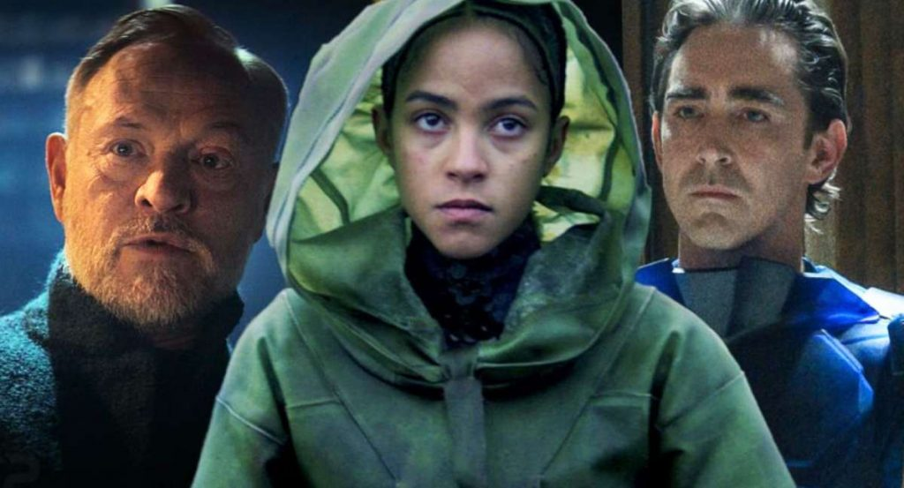

«Основание». Для русскоязычного уха название звучит
странновато – _основание_ кого или чего?, но тут уж переводчики не стали
заморачиваться и перевели «Foundation» дословно. Так и
быть, простим эту забавную несуразицу. Титры сообщают, что проект основан на
цикле романов корифея Азимова, злые языки же ворчат, что от него тут остались
немногие объедки. Хотя дочь Айзека значится в продюсерском комитете – стало быть,
есть ободрение потомства. Ну да ладно, простим и это – ведь замысел оказался
действительно успешно реализован, и фанаты, облизываясь, с нетерпением ждут
третьего сезона. А что же в первых двух? А тут у нас неимоверно далёкое будущее
– какая-то туева хуча десятков тыщ лет от нашей эры, человечество не просто успешно
вышло в космос, но и заселило все возможные для обитания планеты на Млечном
Пути, те же в своих лучших традициях успели позабыть общее прошлое и в кровь
передраться друг с другом. Но и это не самое страшное – вечный спутник
человейника тоталитаризм оказался неистребим, и вот уже много столетий всех их
объединяет межгалактическая Империя. Которой в свою очередь заправляют уже
полтора десятка поколений императоров – Клеонов. Причём в «лучших» традициях
успешных достижений науки будущего – клонированно воспроизводя самих себя. Да
не в одном, а сразу в трёх лицах – юного Брата Рассвета, зрелого Брата Дня и
пожилого брата-Заката. Которые ведут жизнь, соответствующую императорам
галактического уровня – сотнями миллионов, да что там – целыми планетами
уничтожая несогласных бунтарей, рисуя историческую фреску о своих эпохальных
подвигов живыми красками да трахая наложниц, не забывая стереть им память после
ночи плотских утех. Ну и свою многотысячелетнею секретаршу-робота промеж делом.

Помимо банальных и варварских бунтов, безсмысленных и
беспощадных, зреет и куда более серъёзная оппозиция в лице гениального Гэрри
Сэлдона. Полубезумный (как кажется) в духе всех киношно-гениальных учёных
Сэлдон изобретает «психоисторию» - сложный математический замут, позволяющий
предсказывать будущее. А поскольку будущее Империи психоистория сулит
печальное, вместе с тысячью лет упадка для всей человеческой цивилизации,
Сэлдона чуть было не репрессируют, но во имя светлого будущего отправляют в
изгнание на край обитаемой Вселенной – строить «Основание», проект, призванный
спасти человечество. Вместе с ним туда отправляется и юная милашка Гааль
Дорник, единственный вундеркинд, сумевшая постичь хитроумную систему Сэлдона.
Дальше следует многосерийный космический блокбастер с путешествиями во времени
и пространстве, межзвёздными сражениями красочных звездолётов, вечно оживающий,
хоть и давно умерший Сэлдон и внематочная дочь Гааль Сальвор, явно старшая её
по возрасту. Будут и пророчества, и кастования, и новые религии будущего, и
всенепременные ложь, подлоги и обман. Кроме впечатляющих компьютерной графикой
космолётов и нескольких неведомых зверушек типа «Рога Епископа», более никаких
иных рас, кроме подвидов человеческих, во всей обитаемой вселенной не
наблюдается, и это странно. 
Все в угаре и наперебой хвалят Ли Пэйса за гениальную игру. Спорить
не буду - не спец  в актёрстве, смотрю
завсегда лишь на семантику. То есть на того, кого актёр играл – а в данном
случае злокозню и плохиша Дня. Который вызывает соответствующую реакцию.
Конечно, его вполне заслуженно, хоть и далеко не с первой попытки, загнобили,
спустив в открытый космос. Стервозный-по-принуждению андроид Демерзиль, по-видимому,
тоже хорошо сыграна, но интересна опять-таки её роль в третьем сезоне –
угандошат таки или и там выживет? Интересно, Сальвор грохнули насовсем или
как-нибудь воскресят? Ей же только через полторы сотни лет предписано сгибнуть…
И финальная сцена с поклонением менталиков Сэлдону и Гааль в криокапсулах тоже
как бы не очень ясна… .
Не обошлось и без обязательной лэгэбэтэ повесточки – а именно душещипательная
лав стори генерала, то ли патриота, то ли предателя, и его заместителя.
Символично, что за бокалом раритетного вина гибнет именно генерал, а
полюбовничек выживает.
В хитросплетениях сюжета с первого раза тоже разобраться сложно, помогает лишь
непрерывная динамика проекта, зияющие глубины космоса да обаятельная и аппетитная Гааль
Дорник в исполнении мулато-метиски испано-зимбабвийского происхождения Лу
Льобелль. Не совру, признавшись, что помимо прочих её лицезрение было одной из ведущих
мотиваций)).
